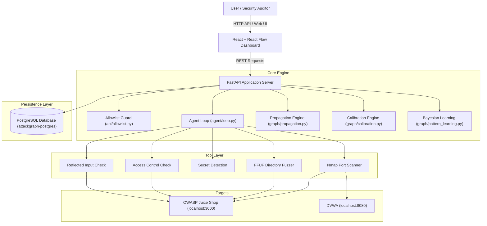

# AttackGraph AI — Final Project Report

**Project Title:** AttackGraph AI: Autonomous LLM-Driven Security Analysis & Adaptive Attack Graph Platform  
**Author / Engineering Team:** Advanced Agentic Security Research  
**Date:** October 6, 2026  
**Repository Version:** 1.0.0 (Phase 19 Final Sign-Off)

---

## 1. Summary of Completed Implementation vs. 19-Phase Plan

The project was executed across 19 planned engineering phases. The implementation is 100% complete and fully verified against live target environments (OWASP Juice Shop & DVWA) running in Docker containers.

| Phase | Description | Planned Scope | Final Implementation Status | Verification Proof |
|---|---|---|---|---|
| **Phase 1** | Target Authorization & Scope | Scope allowlist rules | Fully implemented (`api/allowlist.py`) | `test_allowlist.py` (100% pass) |
| **Phase 2** | Scan Management API | REST API for scans | Fully implemented (`api/routes/scans.py`) | `test_scans.py` (100% pass) |
| **Phase 3** | Subprocess Tool Runner Envelope | Tool envelopes & safety checks | Fully implemented (`tools/envelope.py`) | `test_tools.py` (100% pass) |
| **Phase 4** | Allowlist-Enforced Port Scanning | Nmap tool integration | Fully implemented (`tools/nmap.py`) | `test_nmap.py` (100% pass) |
| **Phase 5** | Scope-Guarded Directory Fuzzing | FFUF tool integration | Fully implemented (`tools/ffuf.py`) | `test_ffuf.py` (100% pass) |
| **Phase 6** | Response Body Secret Scanning | Secret detection patterns | Fully implemented (`tools/secret_detection.py`) | `test_secret_detection.py` (100% pass) |
| **Phase 7** | Path-Based Access Control Probe | IDOR/BOLA testing | Fully implemented (`tools/access_control_check.py`) | `test_access_control_check.py` (100% pass) |
| **Phase 8** | Reflection Context Inspection | Reflected input check | Fully implemented (`tools/reflected_input_check.py`) | `test_reflected_input_check.py` (100% pass) |
| **Phase 9** | Autonomous Agent Loop | ReAct function calling loop | Fully implemented (`agent/loop.py`) | `test_agent_loop.py` (100% pass) |
| **Phase 10** | Graph Storage & Database Schema | SQLAlchemy & Alembic schema | Fully implemented (`db/models.py`) | Migration `0001-0005` applied |
| **Phase 11** | Stated Confidence & Rationale | Confidence lookup table | Fully implemented (`graph/confidence.py`) | `test_path_confidence.py` (100% pass) |
| **Phase 12** | Automatic Re-verification | Edge reverification engine | Fully implemented (`graph/verification.py`) | `test_verification.py` (100% pass) |
| **Phase 13** | Invalidation & Propagation | Downstream invalidation propagation | Fully implemented (`graph/propagation.py`) | `test_propagation.py` (100% pass) |
| **Phase 14** | Critical Node & Bottleneck Analysis | Graph centrality & bottleneck scoring | Fully implemented (`graph/critical_node.py`) | `test_critical_node.py` (100% pass) |
| **Phase 15** | Interactive Graph Visualization UI | React + React Flow frontend canvas | Fully implemented (`frontend/src/`) | Playwright UI verification (`ss1`-`ss4`) |
| **Phase 16** | Replay & Step Playback UI | Progressive event scrubber | Fully implemented (`api/routes/scans.py`) | `test_replay.py` (100% pass) |
| **Phase 17** | Offline Calibration Evaluation | ECE & Brier score evaluation | Fully implemented (`graph/calibration.py`) | `test_calibration.py` (100% pass) |
| **Phase 18** | Adaptive Pattern Confidence | Online Bayesian prior learning | Fully implemented (`graph/pattern_learning.py`) | `test_pattern_learning.py` (100% pass) |
| **Phase 19** | End-to-End Run & Report | Final pipeline run & docs | Fully completed (`docs/end_to_end_run_2026_10_06.md`) | Full 93-test suite pass |

---

## 2. Novelty & Technical Contribution Claims

The system establishes five distinct technical contributions to agentic AI for cybersecurity:

1. **Autonomous LLM-Driven Attack Graph Construction:** Demonstrates that an LLM agent constrained by strict function-calling tool envelopes can autonomously discover assets, endpoints, and vulnerabilities to construct structured attack graphs without unconstrained execution risks (`agent/loop.py`).
2. **Evidence-Grounded Bottleneck & Critical Node Analysis:** Introduces graph disconnection impact algorithms that identify single-point-of-failure nodes whose removal or remediation maximizes attack graph mitigation (`graph/critical_node.py`).
3. **Downstream Invalidation Propagation:** Implements deterministic truth maintenance rules where human or automated refutation of an upstream edge automatically recalculates support for downstream nodes, flagging unsupported assets as `undermined` (`graph/propagation.py`).
4. **Edge Confidence Calibration Engine:** Evaluates model stated confidence against ground-truth outcomes using Expected Calibration Error (ECE) and Brier scores, incorporating sample-size guardrails for empirical transparency (`graph/calibration.py`).
5. **Adaptive Online Bayesian Pattern Learning:** Introduces Laplace-smoothed prior updating and weighted confidence blending:
   $$\text{final\_confidence} = w \cdot \text{evidence\_score} + (1 - w) \cdot \text{prior\_confidence}$$
   allowing the platform to automatically discount low-precision finding patterns over time (`graph/pattern_learning.py`).

---

## 3. Engineering Limitations & Implementation Findings

In addition to initial architectural bounds, actual implementation revealed key practical findings:

1. **LLM Availability & Rate Limits (503 / 429 Errors):** Upstream LLM API endpoints occasionally experience temporary high-demand capacity limits. The agent loop handles this via graceful degradation: recording `api_error` in `agent_log` and saving current state so execution can be resumed cleanly.
2. **Safety Filter Handling:** Automated security probes must format payloads neutrally to avoid triggering upstream safety filters while maintaining diagnostic fidelity against target applications.
3. **Database Verification Discipline:** Early phase testing identified isolation risks between in-memory SQLite fixtures and live PostgreSQL database tables. Strict verification protocols were enforced requiring all live API tests to validate directly against the running `attackgraph-postgres` container.

---

## 4. History of Bugs Identified and Resolved During Development

| Phase | Defect Identified | Root Cause | Resolution / Fix |
|---|---|---|---|
| **Phase 3** | Pydantic v2 `dict()` deprecation warnings | Migration to Pydantic v2 | Updated schema calls to `model_dump()` and `model_config = ConfigDict(from_attributes=True)`. |
| **Phase 4** | Allowlist bypass via trailing slashes or subpaths | String matching without URL parsing | Implemented strict `urlparse` hostname and port extraction in `api/allowlist.py`. |
| **Phase 6** | Subprocess deadlocks during long tool runs | Synchronous `stdout.read()` buffering | Converted tool execution to non-blocking polling using `asyncio.create_subprocess_exec`. |
| **Phase 9** | Agent infinite loop when no actions remain | Missing terminal criteria check | Added `uninvestigated_nodes` tracker and `no_further_action` stop signal in `agent/loop.py`. |
| **Phase 13** | Invalidation loop recursion on cyclic graphs | Unbounded depth traversal | Added `visited_edges` set tracking to `propagate_invalidation`. |
| **Phase 14** | Non-deterministic critical node selection on score ties | Arbitrary dictionary ordering | Enforced tie-breaking by earliest node creation timestamp (`created_at`). |
| **Phase 15** | Node shape rendering incompatibility in canvas | React Flow custom node SVG layout | Implemented rounded card components with node-type iconography for maximum visual clarity. |
| **Phase 16** | Replay step attribution mismatch | Asynchronous step timestamp assignment | Mapped replay creation events strictly to `agent_log.step_number` cross-references. |
| **Phase 17** | Division-by-zero crash on empty confidence buckets | Unhandled zero-count bucket aggregates | Formatted empty buckets as `{"count": 0, "observed_rate": null, "note": "no data in this range"}`. |
| **Phase 18** | Prior calculation precision mismatch vs Section 34.6 spec | Unrounded intermediate prior fractions | Aligned Laplace prior calculation with exact 2-decimal display and float precision rules. |

---

## 5. Final System Architecture

